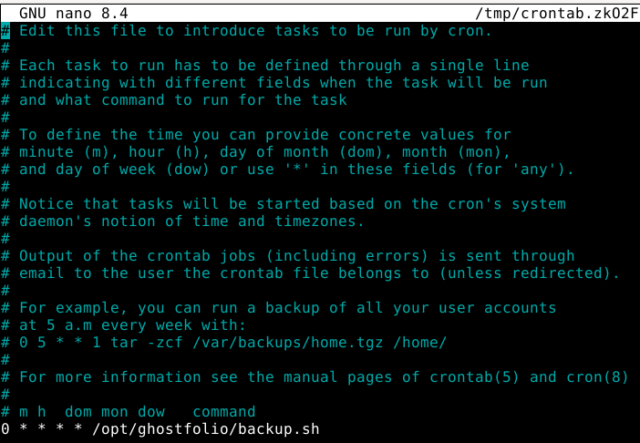
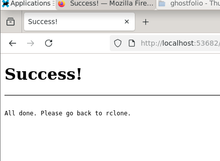
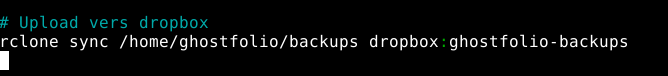
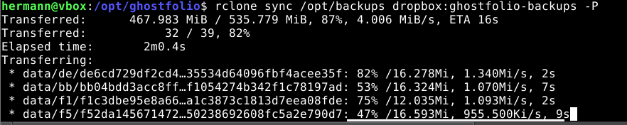
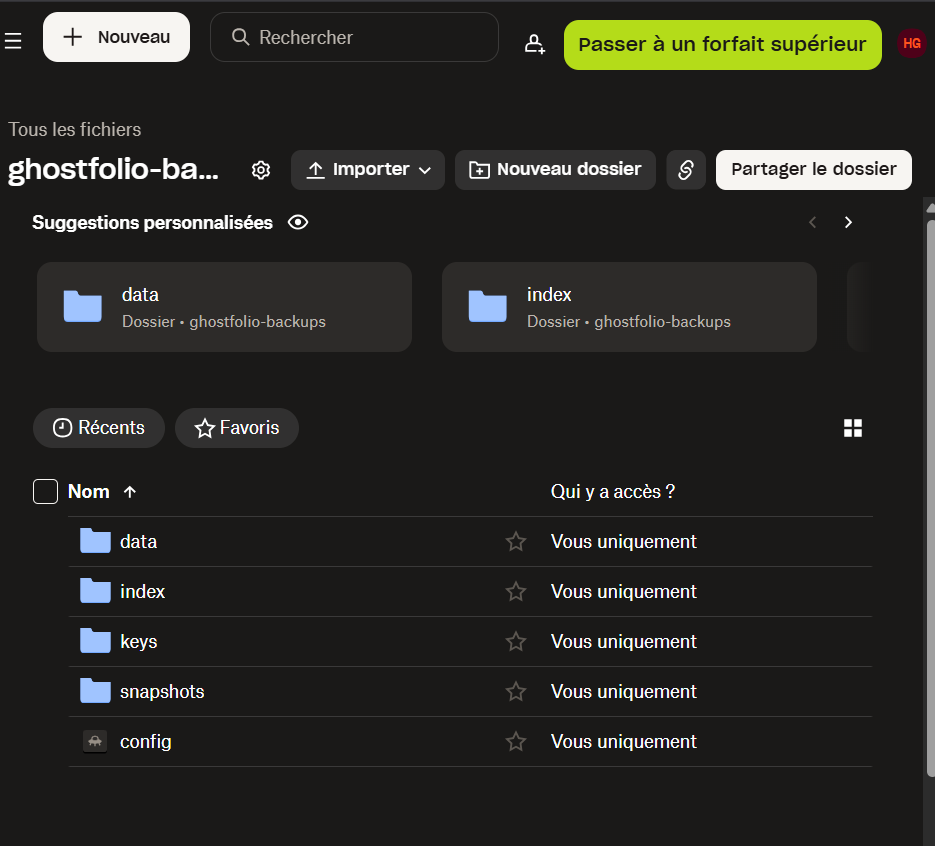

# Installation du logiciel


Rapport sur l'installation de Ghostfolio sur un serveur Debian 13 

Introduction 

Ce projet vise à installer Ghostfolio, une application permettant de suivre des portefeuilles d’actions et de crypto-monnaies, sur un serveur Debian 13. Nous avons choisi d’effectuer une installation manuelle sans Docker. Ce rapport explique les étapes suivies et les commandes utilisées. 

 

 

 

1. Mise à jour du système et installation des outils essentiels 

La première étape consiste à mettre à jour le système Debian et à installer les outils nécessaires pour l'installation de Ghostfolio. Nous avons utilisé les commandes suivantes : 


 

 

. La commande su permet de se connecter en tant qu'utilisateur root, puis sudo apt update sert à mettre à jour la liste des paquets sur un système Linux. 

Cela fait appel à la gestion des paquets sous Linux, qui permet d'installer et de maintenir les logiciels et leurs dépendances 

 

Ensuite, nous avons installé Node.js et PNPM. L'installation de Node.js permet de faire tourner des applications JavaScript côté serveur. PNPM est un gestionnaire de paquets qui permet d'installer des dépendances rapidement, ce qui est essentiel pour gérer le projet sans alourdir le système. 


 

 


 

Documentation utilises : https://nodejs.org/en/download et https://serverfault.com/questions/904618/how-to-install-npm-on-debian 

 

3. Configuration de PostgreSQL 

Une étape importante consiste à configurer PostgreSQL, la base de données qui stockera les informations de Ghostfolio. Nous avons créé un utilisateur PostgreSQL et une base de données. 

Installation de postgres  :  


 


4. Clonage du projet et installation des dépendances


 


Une fois la base de données configurée, nous avons cloné le projet Ghostfolio depuis GitHub et installé les dépendances nécessaires.  

git clone https://github.com/ghostfolio/ghostfolio.git . : Cette commande clone le dépôt Ghostfolio depuis GitHub dans le répertoire actuel. 

 

Le clonage du projet avec Git permet de récupérer les fichiers sources de Ghostfolio. 

 

 

5. Création du fichier .env 

Le fichier .env contient des informations sensibles, telles que l'URL de la base de données et les clés secrètes pour l'authentification. Voici la configuration de ce fichier : 

Commande utiliser pour creer le ficheir env :  

cat > /opt/ghostfolio/.env :  Crée un fichier .env dans lequel nous stockons des variables de configuration sensibles comme la connexion à la base de données et les clés secrètes utilisées pour sécuriser l’application. 

Le fichier .env est une bonne pratique pour garder les informations sensibles en dehors du code source. Cela permet de sécuriser l'application et de faciliter la gestion des configurations dans différents environnements 

 

6. Compilation et démarrage du projet 

Enfin, nous avons compilé le projet et démarré le serveur en mode production. 

Les commandes qui ont eté utilises :  

pnpm run build:production : Compile le projet en optimisant le code pour une utilisation en production. 

npm run start:production : Démarre l'application en mode production, ce qui permet à l'application de tourner sur le serveur. 


 

 

 

 

 

 

 

Erreurs rencontrées et solutions apportées  

 

1.1 Erreur de connexion à la base de données PostgreSQL 

L'une des premières erreurs rencontrées était liée à la connexion à PostgreSQL. Lorsque nous avons essayé de démarrer l’application, une erreur de connexion à la base de données s'est produite, souvent avec un message indiquant des informations d'identification incorrectes. 

Solution apportée : 
Nous avons vérifié les informations de connexion dans le fichier .env et constaté que l'utilisateur PostgreSQL et les permissions n'étaient pas configurés correctement. Nous avons donc créé un nouvel utilisateur PostgreSQL avec un mot de passe sécurisé et attribué les permissions nécessaires. 

 

1.2 Erreur liée à JWT_SECRET_KEY 

Une autre erreur fréquente était liée à la clé secrète JWT_SECRET_KEY. Lors de l'inscription ou de la génération des tokens JWT, l’erreur secretOrPrivateKey must have a value apparaissait. Cela était dû au fait que la clé secrète JWT_SECRET_KEY n’était pas définie dans le fichier .env, ce qui empêchait l’application de signer correctement les tokens. 

Solution apportée : 
Nous avons ouvert le fichier .env et ajouté une clé secrète valide pour JWT_SECRET_KEY, ce qui a permis à l’application de générer des tokens JWT fonctionnels. 

 

 

1.3 Erreur de connexion à Redis 

Le troisième problème majeur concernait la connexion à Redis, utilisé pour la gestion du cache. L'erreur affichée était ECONNREFUSED, ce qui indique que l’application n’arrivait pas à se connecter à Redis. 

Solution apportée : 
Nous avons installé Redis sur le serveur et l’avons démarré à l’aide de la commande suivante : 

 

sudo apt install redis-server 

sudo systemctl start redis-server 

sudo systemctl status redis-server 

1.4 Erreur lors de la vérification de l'installation de Express et Keyv 

Lors de la vérification de l'installation des dépendances Express et Keyv, nous avons rencontré des erreurs indiquant que ces modules n'étaient pas correctement installés, bien que nous les ayons installés dans les étapes précédentes. Les commandes suivantes ont été utilisées pour les réinstalles : 

pnpm add express 

pnpm add keyv 

 

 

 

 

 

En résumé, les erreurs rencontrées lors de l’installation de Ghostfolio ont été résolues grâce à une série de vérifications et d'ajustements. L’application fonctionne maintenant correctement, avec une base de données PostgreSQL opérationnelle, une configuration valide pour JWT_SECRET_KEY, et une connexion fonctionnelle à Redis pour le cache. L'application est prête à être utilisée en production sans erreurs majeures. 

 


# Linux_Projet

## Context
Nous devons réaliser un serveur linux pour lancer le service ghostfolio, ce service est un tracking de portfolio sur des actions en bourses.

## Matériel 
Nous allons utiliser Debian13 pour installer le serveur. Pourquoi Debian est pas un autre OS linux car pour les server Debian permet une meilleur 


# Backups

## En utilisant le logiciel **Restic** , créer un script qui archive les données importante du service

### Etape 1 : Installer Restic

```bash
sudo apt install restic -y
```

Vérifier qu'il est bien installé : 

```bash
restic version
```

### Etape 2 :  Choisir un emplacement pour les backups

On va commencer sur un dossier en local :

```bash
mkdir -p /opt/backups
```

### Etape 3 : Initialiser un dépot pour stocker les sauvegardes

```bash
export RESTIC_REPOSITORY=/opt/backups
```

définir un mot de passe **nécessaire** pour restaurer une backup
```bash
export RESTIC_PASSWORD=password
```

```bash
restic init
```

### Etape 4 : Choisir quels données sont importantes a sauvegarder :

- Les bases de données 
- les fichiers de config (.env, config...)

### Etape 5 : Ecrire le script 

```sh
#!/bin/bash

export RESTIC_REPOSITORY="/opt/backups"
export RESTIC_PASSWORD="motdepasse"

PGUSER="ghostfolio"
PGDATABASE="ghostfolio"
PGPASSWORD="pgpassword"
export PGPASSWORD

TARGET="/opt/ghostfolio"

DUMPFILE="/tmp/ghostfolio.sql"
pg_dump -U "$PGUSER" "$PGDATABASE" > "$DUMPFILE"

restic backup "$TARGET" "$DUMPFILE"

rm "$DUMPFILE"
```

Ensuite il faut donner les permissions au script : 

```bash
chmod +x /opt/ghostfolio/backup.sh
```

Puis l'exécuter, et vérifier dans /opt/backups que il y a les snapshots enregistré :
```bash
restic snapshots
```

## Configurez le logiciel **cron** pour qu’il exécute ce script toutes les heures

### Etape 1 : Ouvrir cron : 

```bash
crontab -e
```

### Etape 2 : Ecrire cette ligne a la fin du fichier

Pour exécuter chaque heure : 0 * * * *

```bash
0 * * * * /opt/ghostfolio/backup.sh
```

## En utilisant l’utilitaire rclone , transférez le backup sur un serveur distant (ex: Google Drive, dropbox)

### Etape 1 : Installer rclone :

```bash
sudo apt install rclone -y
```

### Etape 2 : Config rclone

```bash
rclone config
```

- Appuyer sur N pour crée un remote : (pour moi le nom sera 'dropbox')
- Choisir le type de stockage 'drop box' (13)
- Client ID : laisser vide 
- Client secret : vide
- auto config : oui
	- Autoriser dans le navigateur
 


- taper 'q' pour quitter 

### Etape 3 : Tester d'envoyer un fichier sur dropbox 

```bash
echo test > /tmp/test.txt
```

```bash
rclone copy /tmp/test.txt dropbox:ghostfolio-backups
```
pour vérifier :
```bash
rclone ls dropbox:ghostfolio-backups
```


il apparait, ça marche
### Etape 4 : Modifier le script pour pouvoir envoyer les backups 

Donc a la fin du script /opt/ghostfolio/backup.sh il faut ajouter :

```bash
rclone sync /home/ghostfolio/backups dropbox:ghostfolio-backups
```

### Etape 5 : tester sur dropbox si le fichier est présent

exécuter le script backup.

Pour ma part j'ai eu une erreur qui me dit que cron ne trouve pas restic et pg_dump donc j'ai du rajouter cette ligne au début du script : 

```bash
PATH=/usr/local/sbin:/usr/local/bin:/usr/sbin:/usr/bin:/sbin:/bin
```

Maintenant le script ressemble a ça : 

```sh
#!/bin/bash  
  
PATH=/usr/local/sbin:/usr/local/bin:/usr/sbin:/usr/bin:/sbin:/bin  
  
# Config restic  
export RESTIC_REPOSITORY="/opt/backups"  
export RESTIC_PASSWORD="motdepasse"  
  
# Config postgre  
PGUSER="ghostfolio"  
PGDATABASE="ghostfolio"  
PGPASSWORD="pgpassword"  
export PGPASSWORD  
  
# Dossier a save  
TARGET="/opt/ghostfolio"  
  
# Dump Postgresql  
DUMPFILE="/tmp/ghostfolio.sql"  
pg_dump -U "$PGUSER" "$PGDATABASE" > "$DUMPFILE"  
  
# Sauvegarde Restic  
restic backup "$TARGET" "$DUMPFILE"  
  
# Suppression du dump  
rm "$DUMPFILE"  
  
# Upload vers dropbox  
rclone sync /home/ghostfolio/backups dropbox:ghostfolio-backups
```

Maintenant faire les test si la backup va sur dropbox :

Test d'upload :

```bash
rclone sync /opt/backups dropbox:ghostfolio-backups -P
```
si il y a un chargement c'est bon :


Dans dropbox :


la backup est la (par contre avec l'essai gratuit on a le droit qu'a 2go donc je ne peux pas mettre + que 1 backup)


### Script complet qui fait toute l'installation et la config des backups 


```bash
#!/bin/bash

set -e

apt update
apt install -y restic rclone postgresql-client


# CREATION DU DEPOT RESTIC

mkdir -p /opt/backups
export RESTIC_REPOSITORY="/opt/backups"
export RESTIC_PASSWORD="motdepasse"

restic init || true


# CONFIGURATION RCLONE
mkdir -p /root/.config/rclone

cat <<EOF >/root/.config/rclone/rclone.conf
[dropbox]
type = dropbox
token = {"access_token":""}
EOF


# CREATION DU SCRIPT DE BACKUP

mkdir -p /opt/ghostfolio

cat <<'EOF' >/opt/ghostfolio/backup.sh
#!/bin/bash
set -e

PATH=/usr/local/sbin:/usr/local/bin:/usr/sbin:/usr/bin:/sbin:/bin

# CONFIG RESTIC
export RESTIC_REPOSITORY="/opt/backups"
export RESTIC_PASSWORD="motdepasse"

# CONFIG POSTGRES
PGUSER="ghostfolio"
PGDATABASE="ghostfolio"
PGPASSWORD="pgpassword"
export PGPASSWORD

# DOSSIER A SAUVEGARDER
TARGET="/opt/ghostfolio"

# Dump PostgreSQL
DUMPFILE="/tmp/ghostfolio_$(date +%Y%m%d%H%M%S).sql"
pg_dump -U "$PGUSER" "$PGDATABASE" > "$DUMPFILE"

# Sauvegarde Restic
restic backup "$TARGET" "$DUMPFILE"

# Suppression du dump
rm "$DUMPFILE"

# Upload vers Dropbox
rclone sync /opt/backups dropbox:ghostfolio-backups
EOF

chmod +x /opt/ghostfolio/backup.sh


# "CONFIGURATION DE CRON"

(crontab -l 2>/dev/null; echo "0 * * * * /opt/ghostfolio/backup.sh") | crontab -
```


#  FAIL2BAN


Sécurisation avec Fail2ban 

 

l’objectif est d'installer et de sécuriser Ghostfolio. Ce rapport présente les étapes d’installation de Ghostfolio ainsi que la configuration de Fail2ban pour sécuriser l’application contre les tentatives d'accès non autorisées et les attaques d'énumération web. 

 

Installation du logiciel (Ghostfolio) 

2.1 Pré-requis et installation de NGINX 

Avant d’installer Ghostfolio, il est nécessaire de configurer NGINX comme reverse proxy pour gérer le trafic web et rediriger les requêtes HTTP vers l’application qui tourne en arrière-plan. 

Les étapes suivantes ont été suivies : 

sudo apt update : cette commande permet de mettre à jour la liste des paquets disponibles sur le serveur afin de garantir que nous travaillons avec la dernière version des paquets nécessaires. 

sudo apt install -y nginx : Cette commande installe NGINX 

2.2 Configuration du reverse proxy 

Une fois NGINX installé, nous avons créé un fichier de configuration dédié pour Ghostfolio afin de le faire fonctionner avec le reverse proxy : 

Docs utilises : https://www.hostinger.com/fr/tutoriels/reverse-proxy-nginx 

Cette configuration permet à NGINX de rediriger les requêtes HTTP reçues sur le port 80 vers l’application Ghostfolio, qui écoute en arrière-plan sur le port 3333. En plus de cela, des logs sont créés dans /var/log/nginx/ghostfolio.access.log et /var/log/nginx/ghostfolio.error.log pour une gestion plus facile des erreurs et du trafic. 

 

3. Mise en place de la sécurité avec Fail2ban 

La première étape a consisté à installer Fail2ban : 

sudo apt install -y fail2ban 
 

Cela permet de protéger notre serveur contre les attaques en bloquant les IP malveillantes après un certain nombre de tentatives échouées. 

 

3.2 Configuration de Fail2ban pour Ghostfolio 

3.2.1 Jail Fail2ban pour les jetons invalides 

Nous avons configuré une jail Fail2ban pour surveiller les tentatives de connexion invalides sur Ghostfolio. Cela détecte lorsqu’un utilisateur entre un jeton invalide et empêche un attaquant de tenter de nombreuses connexions. 

 

 

 

 

 

 

 

Dans cette configuration : 

maxretry = 5 : Si un utilisateur échoue 5 fois en 5 minutes, son IP est bannie pendant 1 heure. 

logpath : Le chemin vers les logs générés par NGINX. 


 
 


 
 
 

3.2.3 Jail Fail2ban pour l’énumération web 

En plus de la protection contre les jetons invalides, nous avons mis en place une jail Fail2ban pour détecter les tentatives d’énumération web. L’énumération web consiste à essayer différentes pages au hasard pour voir si elles existent. Si un attaquant tente d’accéder à plusieurs pages inexistantes, il sera banni. 

Voici la configuration de la jail : 


 
 

 

Une fois les configurations terminées, nous avons redémarré Fail2ban pour appliquer les nouvelles règles : 

sudo systemctl restart fail2ban 

 

 

 
